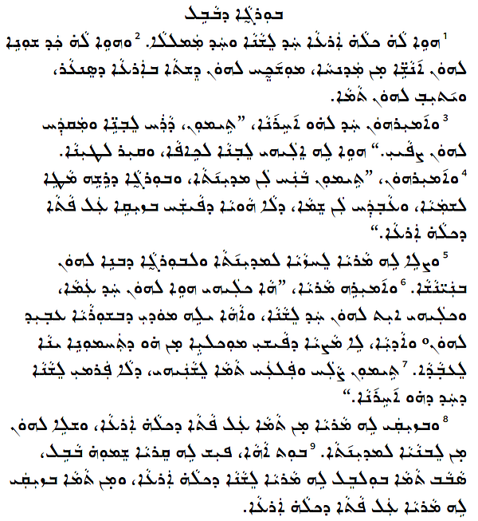

Ramsina is a font family for the East Syriac script. The font was designed as a revival, or facsimile, of metal type cut in India from around 1920. This font was initially designed by Esho Marcus and named East Syriac Marcus. The font is used according to the terms of the [SIL Open Font License](https://openfontlicense.org/). The Latin letters are a subset of the [Crimson Pro](https://github.com/Fonthausen/CrimsonPro) font.

One font from this typeface family is included in the *Ramsina* release:

* Ramsina Regular

## Type Samples

Type samples showing some of the inventory of glyphs can be found here: 
[Ramsina Type Sample](sample.md).

{.fullsize}
<figcaption>Ramsina Sample - Genesis 11</figcaption>

SIL Global is the creator of the Ramsina fonts, and is the owner of all proprietary rights therein.

*Ramsina* is a trademark of SIL Global.